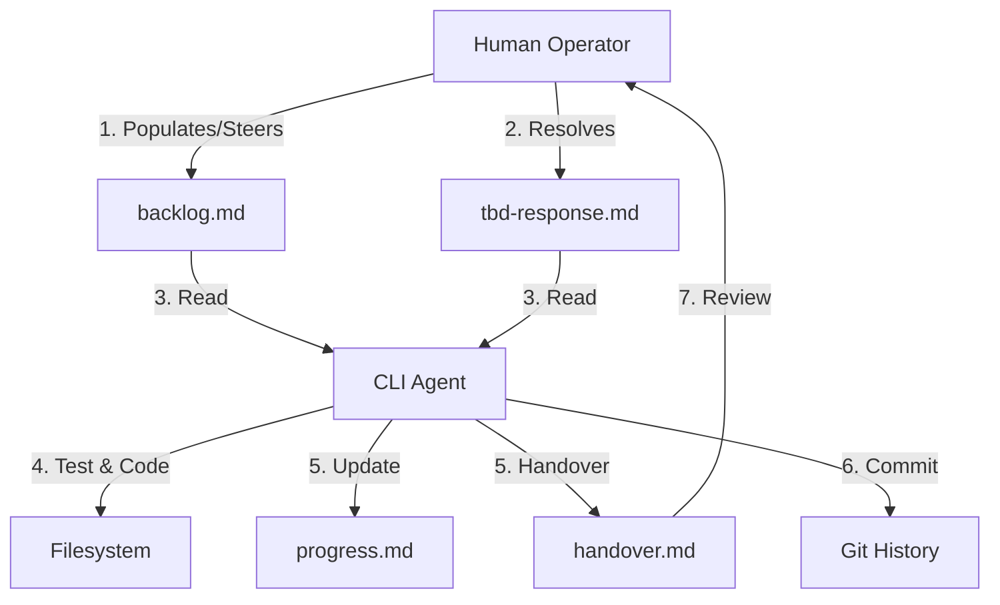

# Agentic Loop Harness

This repository is a publishable harness for running a single bounded CLI-agent task at a time under human oversight.

It is designed to be copied into a target repository so an agent can:
- **Read** its working context from local markdown files.
- **Execute** one discrete backlog item using a TDD-first workflow.
- **Serialize** its state and write a handover for the next run.
- **Stop** rather than guess when requirements are ambiguous.

## The Loop Model

The aim is not to build a fully autonomous multi-agent framework. The aim is to make repeated, context-clear agent runs auditable, reviewable, and portable across providers such as Codex CLI, Gemini CLI, or similar tools.

## What This Repo Contains

- `docs/agent-loop/skill.md`
  The runtime instructions (the "System Prompt") the agent reads inside the target repo.
- `docs/agent-loop/outer-loop-playbook.md`
  The human operator guide for starting runs, handling blockers, archiving state, and steering the next sprint.
- `docs/agent-loop/standards.md`
  A neutral placeholder file to populate with project-specific standards before or during a trial.
- `docs/agent-loop/standards.sample.md`
  An example populated standards file from a TypeScript/Prisma-style project.
- `docs/agent-loop/templates/`
  Blank markdown templates for planning, backlog, progress, handover, and TBD files.
- `init-trial.ps1`
  Creates a sibling trial repo with the harness files and empty active state scaffolded.
- `scripts/`
  Optional operator helpers for skill injection, backlog archival, and lightweight health checks. (e.g., `inject-skill.ps1` dynamically reads `docs/planning.md` to copy requested skills into your workspace).

## Case Study: NYC Traffic Map

To see the harness in action, visit the [Sample-NYCTraffic-Refresh](https://github.com/nikcholer/Sample-NYCTraffic-Refresh) repository. 

This companion project was delivered entirely through the agentic loop, providing a clear audit trail of:
- **One-task-per-run commits**: Each commit maps precisely to a backlog section.
- **TBD escalation**: See `docs/state/archive/` for examples of the agent pausing for human guidance.
- **Markdown state evolution**: The progression of `backlog.md` and `hands-on` handover summaries.

## Core Model

### 1. Local Markdown State
The target repo carries its own working state: `docs/planning.md`, `docs/state/backlog.md`, `docs/state/progress.md`, and `docs/state/handover.md`. This keeps each agent run short-lived, stateless, and restartable. 

### 2. One Task Per Run
Each invocation is expected to complete one bounded unit of work, update the state, commit, and stop. This keeps the git history readable and the narrative inspectable.

### 3. Human Oversight
If the agent hits ambiguity or conflicting requirements, it writes `tbd.md` and stops. The human operator resolves the ambiguity in writing (`tbd-response.md`) before the next run.

### 4. Provider-Agnostic
The harness is orchestration-light. Different CLI agents can pick up the same backlog and continue from the same local ground truth.

## How To Use It

### Option A: Create a New Trial Repo
Run `.\init-trial.ps1` to scaffold a sibling repository with the runtime skill, operator docs, and empty planning/state files ready to populate.

### Option B: Adopt It In An Existing Repo
Copy the harness files into the target repository:
1. Copy `docs/agent-loop/skill.md` to `.agents/skills/agent-loop.md` (a common convention used by many CLI tools, and expected by the `inject-skill.ps1` helper).
2. Copy `docs/agent-loop/outer-loop-playbook.md` into `docs/agent-loop/`.
3. Copy `docs/agent-loop/standards.md` into `docs/agent-loop/` and populate with project standards.
4. Copy the `docs/agent-loop/templates/` folder to `docs/templates/` so you retain them for ongoing use.
5. Seed `docs/planning.md` and `docs/state/` files from your new `docs/templates/` folder.

## License

This project is licensed under the [MIT License](LICENSE).

## Next Reading

- Deployment details: [docs/agent-loop/README.md](docs/agent-loop/README.md)
- Human operator workflow: [docs/agent-loop/outer-loop-playbook.md](docs/agent-loop/outer-loop-playbook.md)
