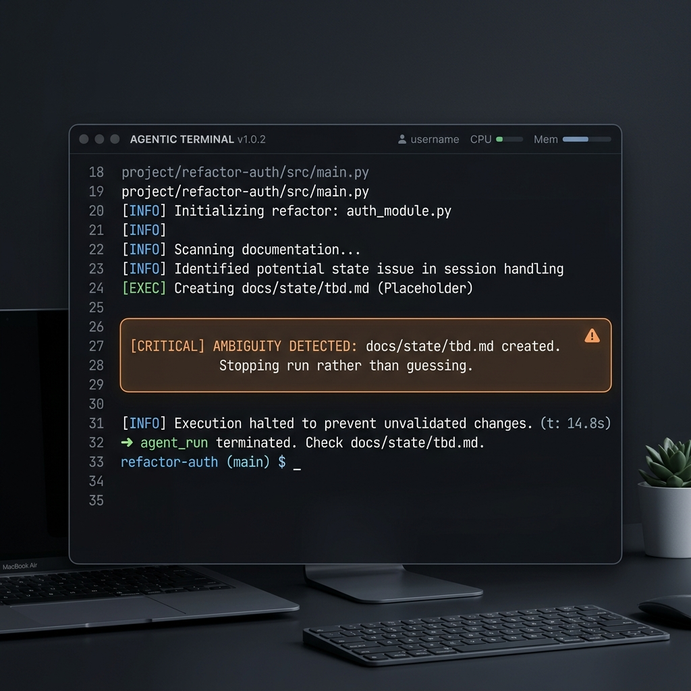
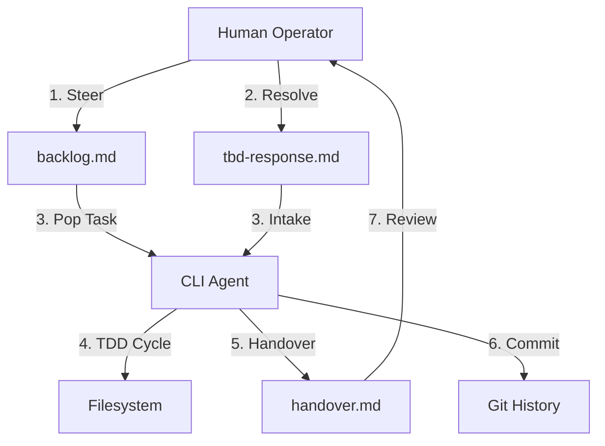

# Agentic Loop Harness

[](https://opensource.org/licenses/MIT)
[](https://github.com/nikcholer/Sample-NYCTraffic-Refresh)

A provider-agnostic harness for running bounded, human-in-the-loop AI agent workflows. 

## The Problem: "Infinite Loop" Fatigue
Existing agentic frameworks often bury state in memory or complex databases, making them hard to audit and prone to "infinite loops" where agents consume tokens without making progress. In a commercial environment, "fully autonomous magic" is often a liability.

## The Solution: Bounded, Git-Native State
This harness extracts the agent's state into transparent, **Git-tracked markdown files**. It forces a "Stop Rather Than Guess" mechanic, ensuring that when requirements are ambiguous, the agent pauses for human oversight instead of hallucinating commits.



---

## How It Works: The Iterative Loop



### 1. The "Stop Rather Than Guess" Mechanic
If the agent hits ambiguity (e.g., conflicting requirements between `planning.md` and `standards.md`), it:
1. **Stops** all execution.
2. **Creates** `docs/state/tbd.md` detailing the blocker.
3. **Exits** cleanly.

The human operator provides a `tbd-response.md`, and only then can the next run proceed. [See the Real-World Example in the Visual Demo.](docs/portfolio/visual-demo.md)

### 2. Command Center: Execution Examples
Trigger the loop using your favorite CLI tools. The harness is designed to be provider-agnostic.

#### Using [Aider](https://aider.chat/)
```bash
aider --message "Read docs/state/backlog.md and execute the top item. Follow instructions in docs/agent-loop/skill.md" --yes
```

#### Using [Gemini CLI](https://github.com/google-gemini/gemini-cli)
```bash
gemini -m gemini-2.5-pro-preview -y -p "Read docs/agent-loop/skill.md and execute the next run strictly from local state."
```

---

## Case Study: NYC Traffic Refresh
The [Sample-NYCTraffic-Refresh](https://github.com/nikcholer/Sample-NYCTraffic-Refresh) project was delivered entirely through this harness. 

**Key Achievements:**
- **Auditability**: Every commit maps 1:1 to a verified backlog item.
- **Reliability**: An Aider agent successfully refactored a legacy API and wrote 15 passing tests.
- **Control**: The agent paused 3 times for human clarification, preventing a single hallucinated commit.

---

## TDD in Action
The harness enforces a strict `Red -> Green -> Refactor` workflow.

**Snippet: `docs/state/progress.md` during a run:**
```markdown
## [2026-04-17] Sprint 1: API Refactor
- [x] Create failing test for `GET /api/v1/traffic` (Red)
- [x] Implement basic controller logic (Green)
- [ ] Refactor middleware for performance (Refactor - In Progress)
```

---

## Extensibility: The Skill Library
This harness supports a "Plugin" architecture through supplementary skills.

### 1. Adding New Skills
You can extend the agent's capabilities by adding markdown files to `.agents/skills/`. For example, adding `pytest-expert.md` with specific testing instructions will make the agent aware of those rules during execution.

### 2. Conditional Skill Injection
The included `inject-skill.ps1` helper allows you to dynamically load skills based on the requirements defined in `docs/planning.md`. 
- Define a `## Skills` section in your planning document.
- List the skills required for the current milestone.
- Run the injector to sync only the necessary logic into the target repo, keeping the agent's context window clean.

---

## How To Use It

### Quick Start (Scaffold a Trial)
If you have Node installed:
```bash
npx @nikcholer/agentic-loop-harness init
```
*(Or manually run `.\init-trial.ps1` in a clone of this repo)*

### Adoption in Existing Repos
1. Copy `docs/agent-loop/skill.md` to `.agents/skills/agent-loop.md`.
2. Seed your `docs/state/` folder using the provided [templates](docs/agent-loop/templates/).
3. Define your project standards in `docs/agent-loop/standards.md`.

## License
MIT. Built for the evolving agentic coding landscape.
