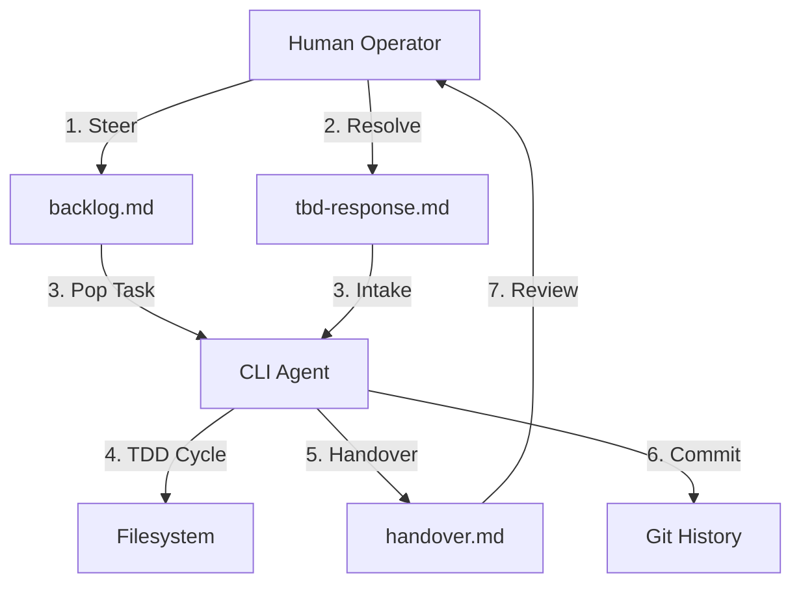
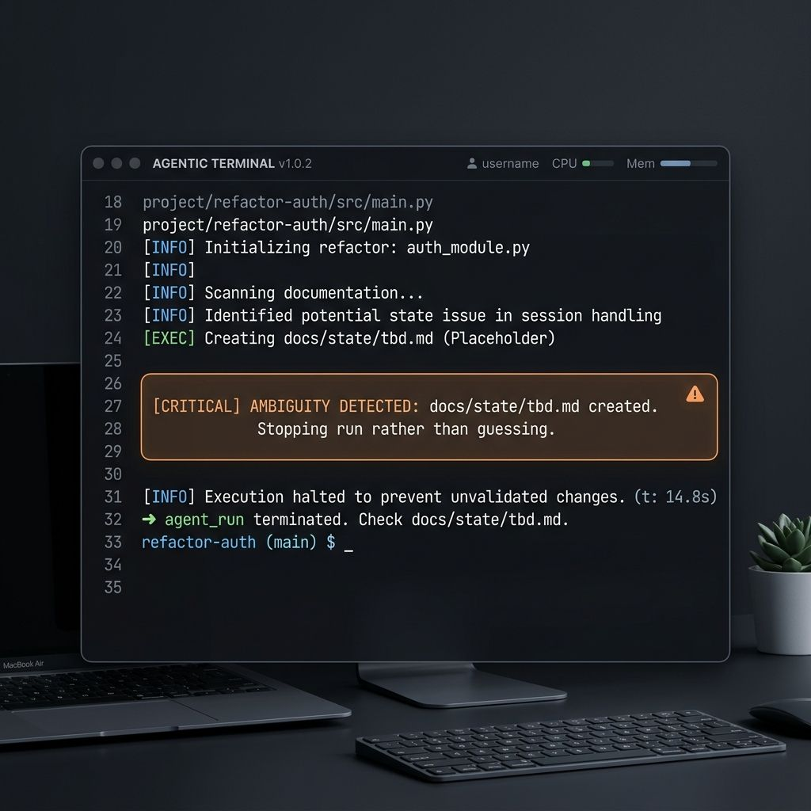

# Agentic Loop Harness

[](https://opensource.org/licenses/MIT)
[](https://github.com/nikcholer/Sample-NYCTraffic-Refresh)

A provider-agnostic harness for bounded, human-in-the-loop agent work. The agent can plan, edit, and test. Its state lives in Git-tracked markdown, and it must stop when requirements are ambiguous. That keeps the workflow auditable with ordinary engineering practice instead of burying it in a chat transcript or a vendor memory layer.

## How it works

Each run is one discrete unit of work. The agent wakes up, reads local markdown, executes a single backlog item, serializes state, commits, and exits. The human steers between runs.


```mermaid
graph TD
    H[Human Operator] -->|1. Steer| B[backlog.md]
    H -->|2. Resolve| TBD[tbd-response.md]
    B -->|3. Pop Task| A[CLI Agent]
    TBD -->|3. Intake| A
    A -->|4. TDD Cycle| FS[Filesystem]
    A -->|5. Handover| HO[handover.md]
    A -->|6. Commit| Git[Git History]
    HO -->|7. Review| H
```

If planning and standards conflict, the agent does not guess:

1. It stops.
2. It writes `docs/state/tbd.md`.
3. It exits cleanly.

The next run proceeds only after you add `tbd-response.md`. [See the visual demo](docs/portfolio/visual-demo.md).



## Supported headless invocations

Use the same prompt with any capable CLI. The provider is not part of the harness state model.

```text
Read .agents/skills/agent-loop.md and execute the next run strictly from the repository's local markdown state.
```

| Provider | Headless command |
| --- | --- |
| [Grok Build](https://github.com/xai-org) | `grok -p "…" --always-approve --max-turns 15` |
| [Claude Code](https://code.claude.com/docs/en/cli-reference) | `claude -p "…" --dangerously-skip-permissions --max-turns 15` |
| [Gemini CLI](https://github.com/google-gemini/gemini-cli) | `gemini -m gemini-2.5-pro --approval-mode yolo -p "…"` |
| [OpenAI Codex](https://github.com/openai/codex) | `codex exec --dangerously-bypass-approvals-and-sandbox "…"` |
| [Aider](https://aider.chat/) | `aider -m "…" --yes --no-gitignore --model <provider>/<model>` |
| [OpenCode](https://opencode.ai/) | `opencode run --dangerously-skip-permissions --log-level WARN "…"` |

Copy-paste examples:

```bash
# Grok Build
grok -p "Read .agents/skills/agent-loop.md and execute the next run strictly from the repository's local markdown state." --always-approve --max-turns 15

# Claude Code
claude -p "Read .agents/skills/agent-loop.md and execute the next run strictly from the repository's local markdown state." --dangerously-skip-permissions --max-turns 15

# Gemini CLI
gemini -m gemini-2.5-pro --approval-mode yolo -p "Read .agents/skills/agent-loop.md and execute the next run strictly from the repository's local markdown state."

# OpenAI Codex
codex exec --dangerously-bypass-approvals-and-sandbox "Read .agents/skills/agent-loop.md and execute the next run strictly from the repository's local markdown state."

# Aider
aider -m "Read .agents/skills/agent-loop.md and execute the next run strictly from the repository's local markdown state." --yes --no-gitignore --model <provider>/<model>

# OpenCode
opencode run --dangerously-skip-permissions --log-level WARN "Read .agents/skills/agent-loop.md and execute the next run strictly from the repository's local markdown state."
```

Prefer a turn cap (`--max-turns 15` or equivalent) when the provider offers one. Full notes, model strings, and endpoint caveats live in the [outer-loop playbook](docs/agent-loop/outer-loop-playbook.md).

## Quick start

**Node (any OS):**

```bash
npx @nikcholer/agentic-loop-harness init
```

**From a clone:**

```powershell
# Windows / PowerShell Core (recommended operator path)
pwsh -File .\init-trial.ps1

# Linux / macOS
./init-trial.sh
```

Then populate `docs/planning.md` and `docs/state/backlog.md`, run the pre-run ritual below, and invoke one of the commands above from the trial repo root.

### Adopt in an existing repo

1. Copy `docs/agent-loop/skill.md` to `.agents/skills/agent-loop.md`.
2. Seed `docs/state/` from the [templates](docs/agent-loop/templates/).
3. Write project-specific rules in `docs/agent-loop/standards.md`. That file is a per-project slot, not a universal rulebook.

See the [deployment guide](docs/agent-loop/README.md) for the full bootstrap checklist.

## Pre-run ritual

Start every loop from a tree you understand:

```bash
git status
# clean tree preferred

# portable
npx @nikcholer/agentic-loop-harness health

# or, from a clone
pwsh -File scripts/check-health.ps1
# bash scripts/check-health.sh
```

If `docs/state/tbd.md` exists without a matching `tbd-response.md`, do not start another run.

## Operator tooling

| Command | What it does |
| --- | --- |
| `npx @nikcholer/agentic-loop-harness init` | Scaffold a trial repo or inject the harness into an existing one |
| `npx @nikcholer/agentic-loop-harness health` | Fail closed on unresolved TBD or a dirty worktree |
| `npx @nikcholer/agentic-loop-harness run --provider grok` | Run N headless iterations and stop on `tbd.md` |
| `scripts/check-health.ps1` / `scripts/check-health.sh` | Same health gate without Node |
| `scripts/run-loop.ps1` / `scripts/run-loop.sh` | Same bounded outer loop without Node |
| `scripts/archive-backlog.ps1` | Archive completed backlog sections (human-only) |
| `scripts/inject-skill.ps1` | Copy optional skills listed under `## Skills` in `planning.md` |

PowerShell Core is the richest operator path. `init`, `health`, and `run` are also first-class on bash and via the Node CLI.

## Case study: NYC Traffic Refresh

[Sample-NYCTraffic-Refresh](https://github.com/nikcholer/Sample-NYCTraffic-Refresh) was delivered entirely through this harness.

- **Auditability:** every commit maps to a verified backlog item.
- **Reliability:** an agent refactored a legacy API and left 15 passing tests.
- **Control:** the agent paused three times for human clarification and never produced a hallucinated commit.

The loop enforces `Red -> Green -> Refactor`. A typical `docs/state/progress.md` slice looks like this:

```markdown
## [2026-04-17] Sprint 1: API Refactor
- [x] Create failing test for `GET /api/v1/traffic` (Red)
- [x] Implement basic controller logic (Green)
- [ ] Refactor middleware for performance (Refactor - In Progress)
```

### Why this still matters in 2026

Agent CLIs are better than they were a year ago. They still hide state in sessions, vendor memory, and JSON event streams. That is fine for pairing. It is a liability when you need a reviewable trail, a stop point a junior engineer can understand, and the freedom to swap Grok, Claude, Gemini, or a cheaper OpenAI-compatible model between runs.

This harness treats markdown in Git as the source of truth. ACP / `stream-json` output is telemetry. The commit is the record.

## Go deeper

- Runtime contract: [`docs/agent-loop/skill.md`](docs/agent-loop/skill.md)
- Human operator playbook: [`docs/agent-loop/outer-loop-playbook.md`](docs/agent-loop/outer-loop-playbook.md)
- Visual demo and case studies: [`docs/portfolio/visual-demo.md`](docs/portfolio/visual-demo.md)
- Compliance checklist: [`tests/compliance/README.md`](tests/compliance/README.md)

## License

MIT. Built for the evolving agentic coding landscape.
