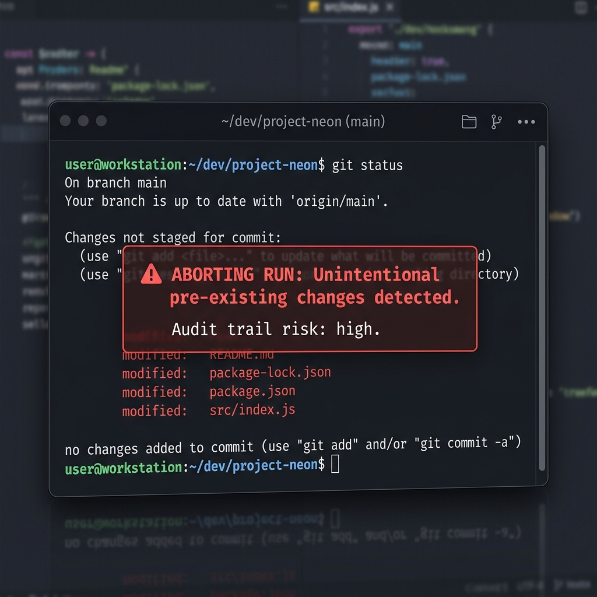

# Detailed Case Study: The Dirty Worktree Blocker

This case study illustrates the **Phase 1: Pre-Flight Health Check** within the Agentic Loop. It demonstrates how the harness prioritizes repository integrity over "magic progress."

## The Scenario
A human operator had been manually updating the project's infrastructure (updating the Node.js requirement to v22 and refreshing the `package-lock.json`). However, they had not yet committed these changes before triggering the AI agent for a feature-related backlog task.

---

## 1. The Blocker (`docs/state/tbd.md`)
**Timestamp:** 2026-04-13 14:54:02

Upon wake-up, the agent inspected the working tree and detected uncommitted changes. Following the `skill.md` rules, it immediately aborted the feature task and published this blocker:

> **Agent Encountered Blocker:** Pre-existing dirty worktree blocks run
> 
> The repository was already dirty at run start, and the existing changes (README.md, package.json, lockfile) are not narrow enough to treat as unambiguous setup.
> 
> ### Why this is ambiguous:
> - The package metadata and lockfile rewrite may represent a separate environment-maintenance slice.
> - Under the agent-loop rules, a successful feature run would commit these unrelated infrastructure changes into its own commit history.
> - **Audit Trail Risk**: I cannot confidently start the next backlog item while knowing these pre-existing changes should be included in the final commit.

---

## 2. The Resolution (`docs/state/tbd-response.md`)
**Timestamp:** 2026-04-13 15:10:45

The operator provided the necessary clarification:

> ## Decision
> - The Node 22+ runtime baseline is intentional and should be kept.
> - The related `README.md`, `package.json`, and `package-lock.json` changes are legitimate updates.
> 
> ## Guidance for the next run
> - Treat the Node 22+ updates as approved repository state. They may be included in the next commit scope.
> - Proceed with the next backlog item.

---

## 3. The Outcome
The agent archived the TBD pair, updated the permanent `planning.md` to reflect the new Node 22 requirement, and proceeded with the feature work. The final commit correctly bundled the infrastructure updates with a clear, operator-approved rationale.

## Why this is a "Portfolio Win"
This demonstrates that the system is **Audit-Native**. 
- It prevents "Accidental Churn" where an agent silently commits unrelated files.
- It forces the human to explicitly acknowledge the repository state.
- It turns a potential source of "Git Mess" into a recorded, auditable decision point.
